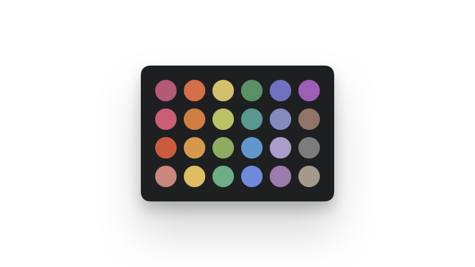
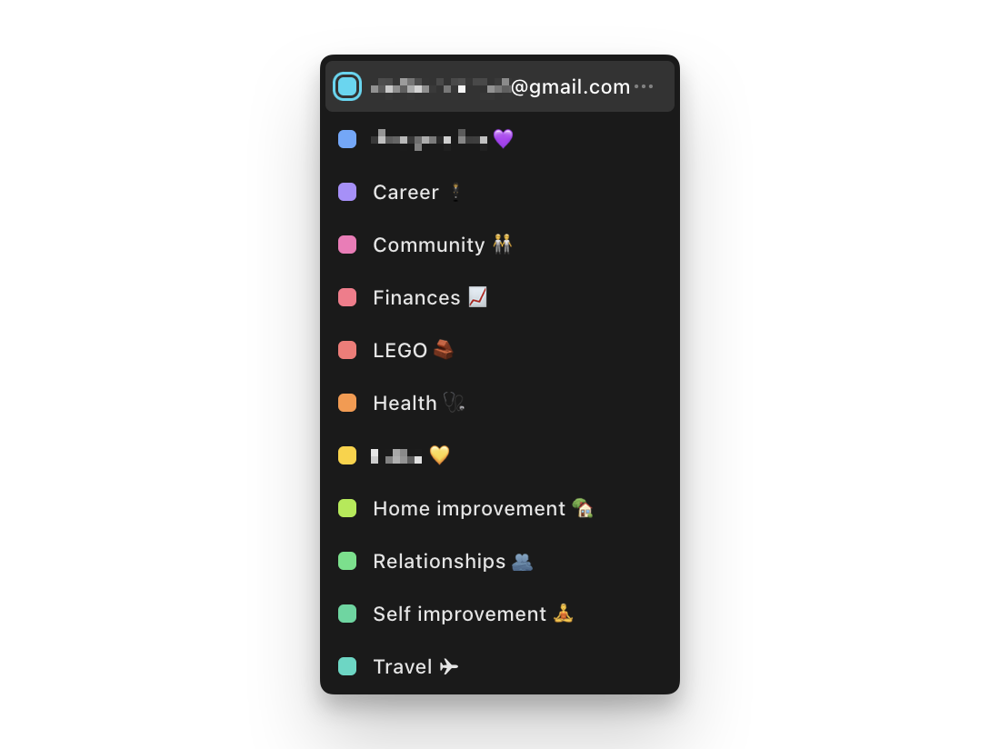

# Tailwind Palette Generator 🌈

A quick tool to help me customize my google calendar colors. [Try it out!](https://crickford.github.io/tailwind-color-picker/)

Built with Claude Artifacts ([source chat](https://claude.ai/share/17ff1000-1bfd-4041-83b6-4ea353fc7522)) & [claude-artifact-runner](https://github.com/claudio-silva/claude-artifact-runner)

## Wait, what?

Google's calendars default color options are kinda limited (and not that appealing IMO)

I wanted my calendars to be fun hues, with consistent lightness and saturation (for legibility). I also wanted the colors to be in chromatic order.

Like this!

## Ok, so how do we get there?

TailwindCSS has a lovely [color palette](https://tailwindcss.com/docs/colors) which is organized by hue and lightness, and perfect for this task...

And honestly I should've just used that. Pick a column, twelve shift+clicks, pasting into google calendar and there we are.

But here's the thing.

That would be boring. (Plus, I didn't see the shift-click to copy nearest hex color feature on the docs page...)

It's waayyy more fun to burn GPU cycles prompting an LLM to do the work for me, building a rather useless tool for a one off idea 😎

So here we are now.

I'm pretty happy with the result 💅
